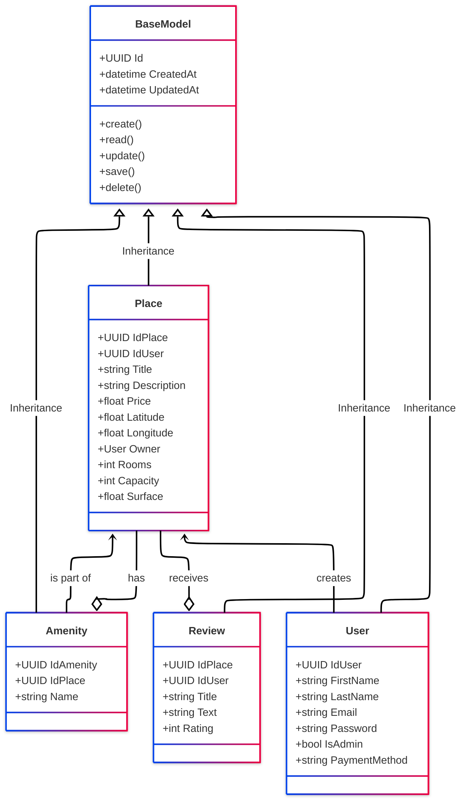

## Class Diagram

```mermaid
---
config:
  look: neo
  layout: elk
  theme: neo
---
classDiagram
direction BT
    class BaseModel {
	    +UUID Id
	    +datetime CreatedAt
	    +datetime UpdatedAt
	    +create()
	    +read()
	    +update()
	    +save()
	    +delete()
    }
    class Amenity {
	    +UUID IdAmenity
	    +UUID IdPlace
	    +string Name
    }
    class Review {
	    +UUID IdPlace
	    +UUID IdUser
	    +string Title
	    +string Text
	    +int Rating
    }
    class Place {
	    +UUID IdPlace
	    +UUID IdUser
	    +string Title
	    +string Description
	    +float Price
	    +float Latitude
	    +float Longitude
	    +User Owner
	    +int Rooms
	    +int Capacity
	    +float Surface
    }
    class User {
	    +UUID IdUser
	    +string FirstName
	    +string LastName
	    +string Email
	    +string Password
	    +bool IsAdmin
	    +string PaymentMethod
    }
    Review o-- Place : receives
    Amenity o-- Place : has
    User --|> BaseModel : Inheritance
    Place --|> BaseModel : Inheritance
    Review --|> BaseModel : Inheritance
    Amenity --|> BaseModel : Inheritance
    User --> Place : creates
    Amenity --> Place : is part of
```
