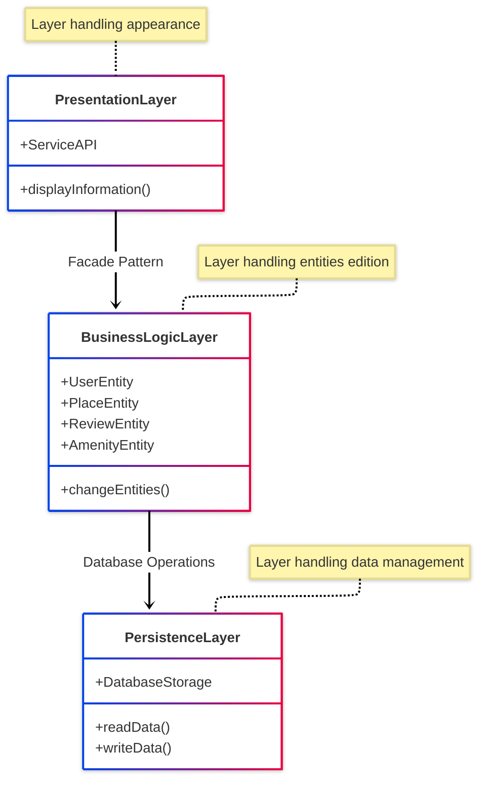

## Package Diagram

```mermaid
---
config:
  theme: neo
  layout: elk
  look: neo
---
classDiagram
direction TB
    class PresentationLayer {
	    +ServiceAPI
	    +displayInformation()
    }
    class BusinessLogicLayer {
	    +UserEntity
	    +PlaceEntity
	    +ReviewEntity
	    +AmenityEntity
	    +changeEntities()
    }
    class PersistenceLayer {
	    +DatabaseStorage
	    +readData()
	    +writeData()
    }
	note for PresentationLayer "Layer handling appearance"
	note for BusinessLogicLayer "Layer handling entities edition"
	note for PersistenceLayer "Layer handling data management"
    PresentationLayer --> BusinessLogicLayer : Facade Pattern
    BusinessLogicLayer --> PersistenceLayer : Database Operations
```
