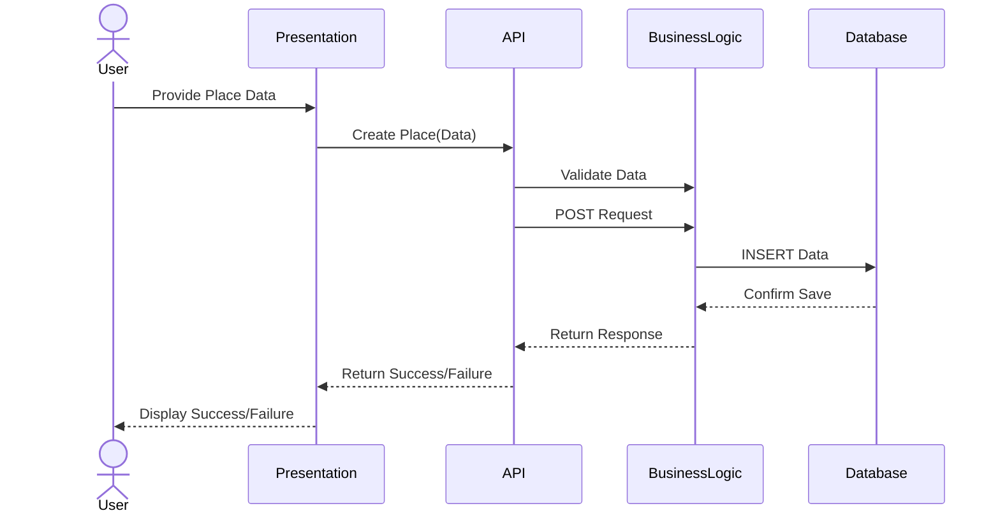

## Sequence Diagram: Place Creation

```mermaid
---
config:
  look: classic
  theme: default
---
sequenceDiagram
  actor User as User
  participant Presentation as Presentation
  participant API as API
  participant BusinessLogic as BusinessLogic
  participant Database as Database
  User ->> Presentation: Provide Place Data
  Presentation ->> API: Create Place(Data)
  API ->> BusinessLogic: Validate Data
  API ->> BusinessLogic: POST Request
  BusinessLogic ->> Database: INSERT Data
  Database -->> BusinessLogic: Confirm Save
  BusinessLogic -->> API: Return Response
  API -->> Presentation: Return Success/Failure
  Presentation -->> User: Display Success/Failure
```
