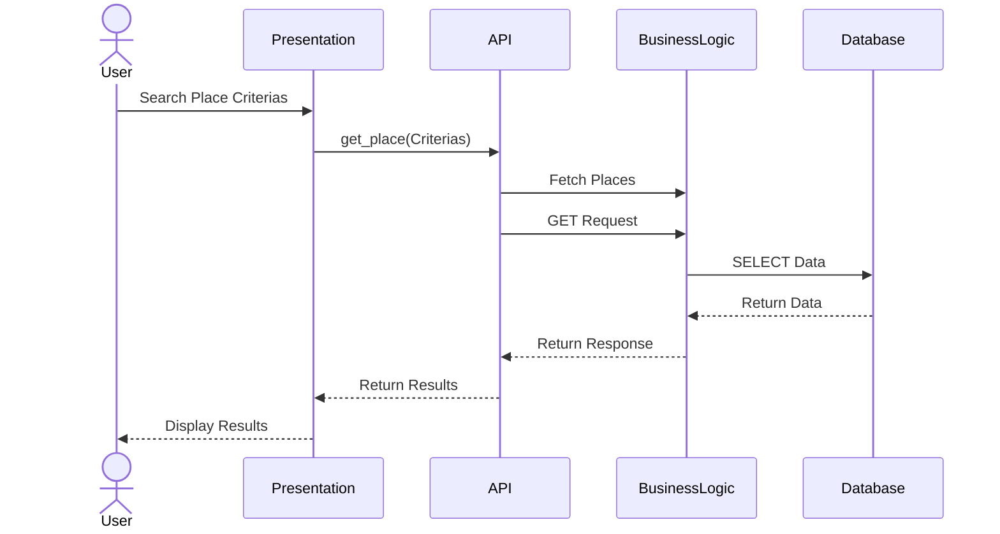

## Sequence Diagram: Place List Fetching

```mermaid
---
config:
  look: classic
  theme: default
---
sequenceDiagram
  actor User as User
  participant Presentation as Presentation
  participant API as API
  participant BusinessLogic as BusinessLogic
  participant Database as Database
  User ->> Presentation: Search Place Criterias
  Presentation ->> API: get_place(Criterias)
  API ->> BusinessLogic: Fetch Places
  API ->> BusinessLogic: GET Request
  BusinessLogic ->> Database: SELECT Data
  Database -->> BusinessLogic: Return Data
  BusinessLogic -->> API: Return Response
  API -->> Presentation: Return Results
  Presentation -->> User: Display Results
```
