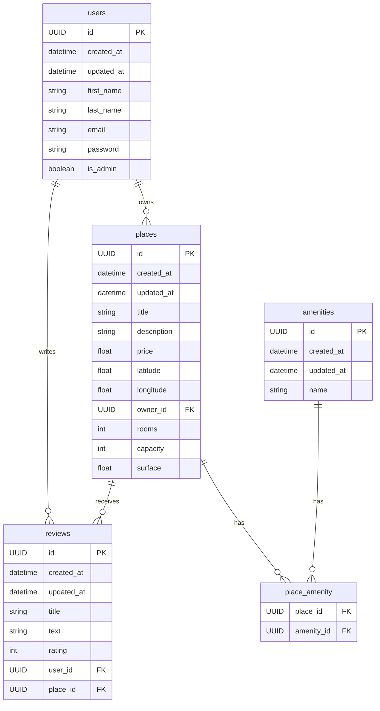

## Entity Relationship Diagram

```mermaid
erDiagram
    users {
        UUID id PK
		datetime created_at
		datetime updated_at
        string first_name
        string last_name
        string email
        string password
        boolean is_admin
    }

    places {
        UUID id PK
		datetime created_at
		datetime updated_at
        string title
        string description
        float price
        float latitude
        float longitude
        UUID owner_id FK
        int rooms
        int capacity
        float surface
    }

    amenities {
        UUID id PK
		datetime created_at
		datetime updated_at
        string name
    }

    reviews {
        UUID id PK
		datetime created_at
		datetime updated_at
        string title
        string text
        int rating
        UUID user_id FK
        UUID place_id FK
    }

    place_amenity {
        UUID place_id FK
        UUID amenity_id FK
    }

    users ||--o{ places : owns
    users ||--o{ reviews : writes
    places ||--o{ reviews : receives
    places ||--o{ place_amenity : has
    amenities ||--o{ place_amenity : has
```
